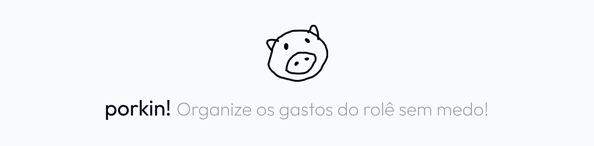
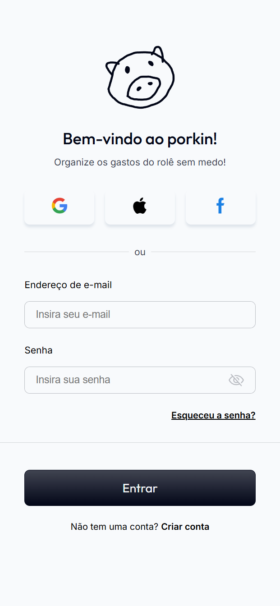
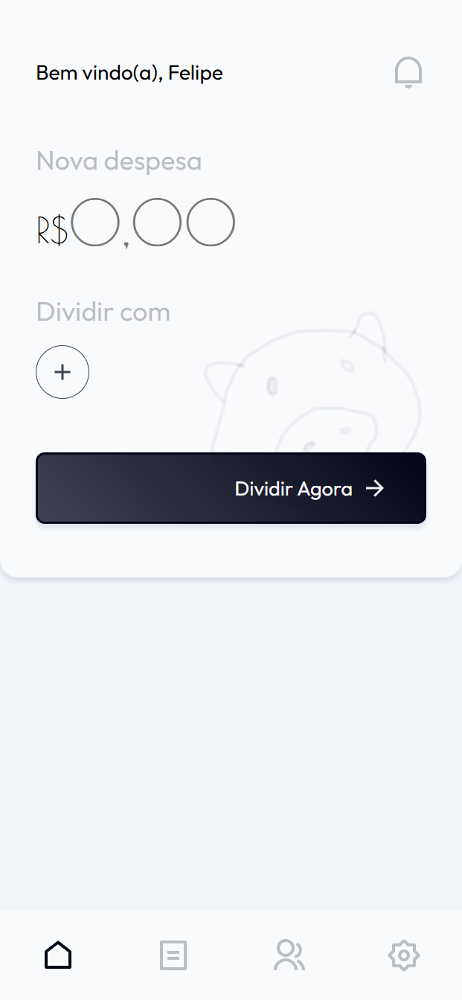
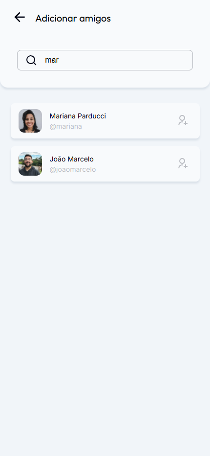
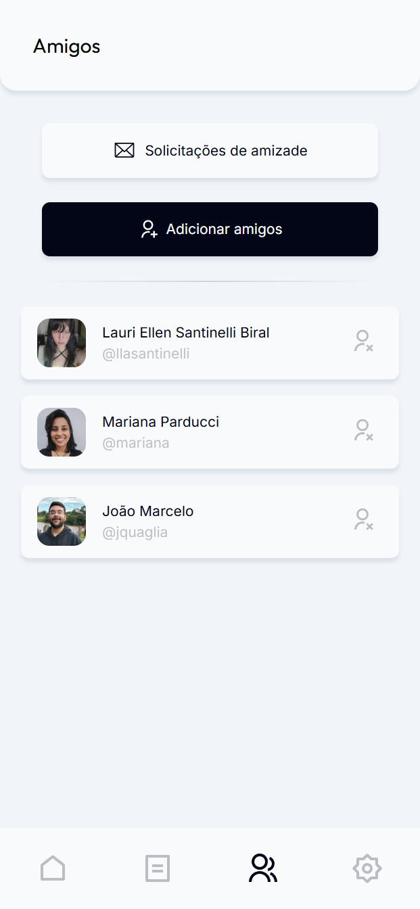
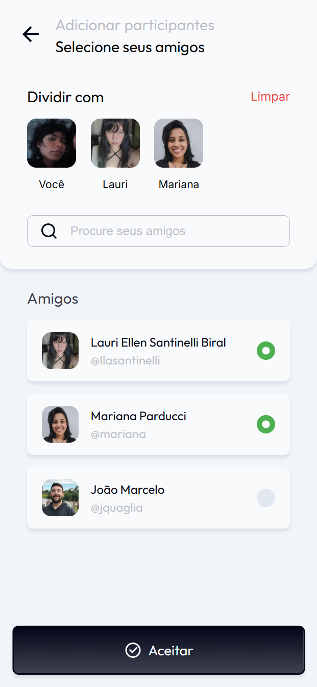
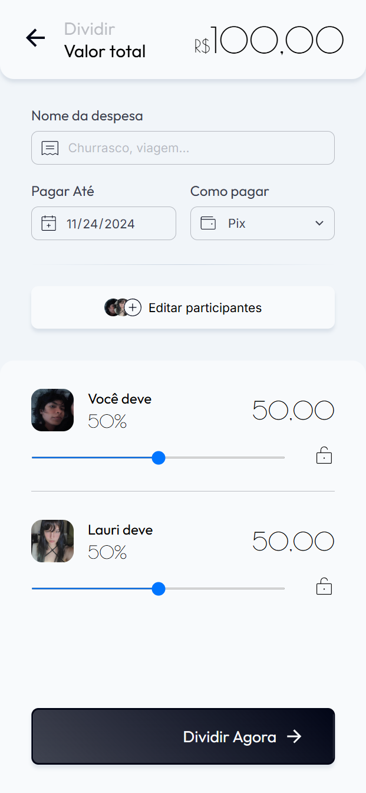
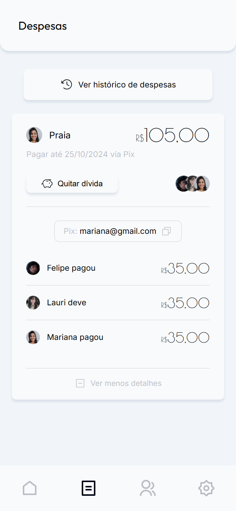
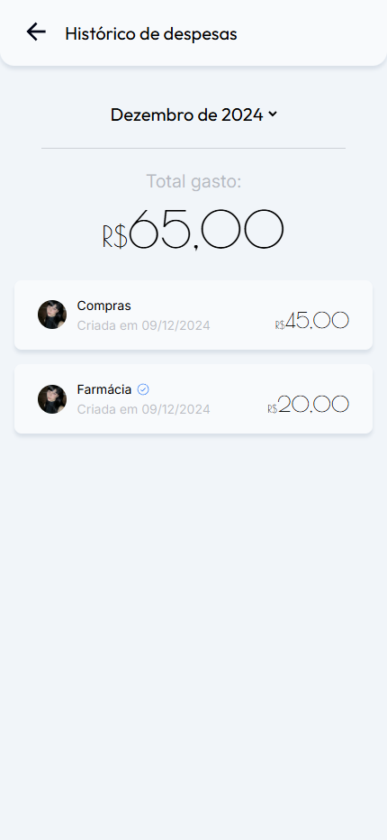
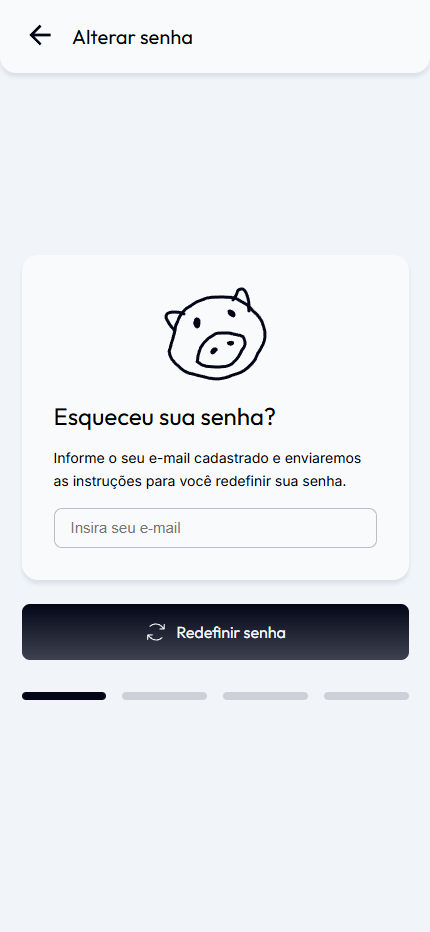

# 

 

🌟 NOS DÊ UMA ESTRELA!

<!--  -->

## Tabela de conteúdos

- [Sobre](#-sobre)
- [Tecnologias utilizadas](#-tecnologias-utilizadas)
- [Deploy](#-deploy)
- [Como usar](#-como-usar)
- [Planejamentos futuros](#-planejamentos-futuros)
- [Licença](#-licença)

## 🐷 Sobre

**porkin!** é uma aplicação web desenvolvida para quem precisa organizar as despesas de um evento com os amigos de maneira simples, rápida e sem complicações. Sabemos que, na correria, é fácil perder o controle de quem pagou o quê e quem deve para quem, especialmente quando as dívidas são quitadas após algum tempo. **porkin!** facilita esse processo, permitindo que todos acompanhem as despesas em tempo real, garantindo transparência e evitando mal-entendidos. Com uma interface intuitiva e funcionalidades pensadas para o dia a dia, ele é a solução perfeita para manter as contas em ordem e focar no que realmente importa: aproveitar os momentos com os amigos.

 Screenshots

  
    

    
&nbsp;
    
&nbsp;
    
 
    
&nbsp;
    
&nbsp;
    
 
    
&nbsp;
    
&nbsp;
    

## 💻 Tecnologias utilizadas

- **JDK 21 (Amazon Corretto)**: Java é a linguagem de programação utilizada no back-end deste projeto.
- **Spring Boot**: Framework java.
  - **Spring Data JPA**: Para gerenciar a persistência de dados e as interações com o banco de dados.
- **PostgreSQL**: Banco de dados relacional utilizado para armazenamento de dados.
- **Maven**: Gerenciamento de dependências.
- **Javascript**: Javascript é a linguagem de programação utilizada no front-end deste projeto.
- **HTML**: Linguagem de marcação usada para estruturar o conteúdo das páginas web.
- **CSS**: Linguagem de estilo usada para definir a aparência visual das páginas web.
- **Webpack**: Ferramenta para empacotamento de módulos JavaScript, otimizando recursos para o frontend.  
- **GSAP**: Biblioteca JavaScript para animações. 

## 📦 Deploy

A aplicação foi implantada utilizando uma combinação de **Neon**, **Docker**, **Render** e **Vercel**.

> [!IMPORTANT]
> Devido às limitações dos planos gratuitos, a aplicação pode apresentar lentidão ao responder às solicitações dos usuários.

 🟣 deploy info

### [Neon](https://neon.tech/)

Neon é um banco de dados PostgreSQL serverless que oferece armazenamento escalável e execução sob demanda.
Utilizamos para subir o banco de dados.

### [Docker](https://www.docker.com/products/docker-desktop/) 

Docker é uma plataforma para criar, testar e implantar aplicações em containers, garantindo que o software funcione de maneira consistente em qualquer ambiente. Containers são usados para empacotar aplicações com todas as suas dependências.

### [Render](https://render.com) 

Render é uma plataforma de hospedagem em nuvem que facilita a implantação de aplicativos web, microsserviços e bancos de dados, oferecendo escalabilidade automática e monitoramento integrado. 
Utilizamos para subir o back.

### [Vercel](https://vercel.com)

Vercel é uma plataforma de hospedagem em nuvem frontend que facilita o desenvolvimento, pré-visualização e implantação de sites e aplicações web.
Utilizamos para subir o front.

## 📱 Como usar

### Criação da rede de contatos

- Permite a criação de uma rede de contatos.
- Caso o usuário deseje compartilhar um valor com outras pessoas, os contatos devem ser adicionados antes da inserção de uma nova despesa.

### Inserção e divisão

- Na página inicial, o valor a ser dividido pode ser definido e vinculado a uma ou mais pessoas da rede.
- O custo total é inicialmente dividido de forma igual entre todos os participantes.
- Os valores podem ser ajustados posteriormente, de acordo com as necessidades do grupo.
- O usuário criador tem a opção de adicionar seu Pix ou PayPal à despesa criada.

### Gestão de cobranças

- A cobrança permanece pendente, exibindo o valor que cada pessoa deve pagar e a data limite para pagamento.
- No dia do vencimento, uma notificação é enviada como lembrete para aqueles que ainda não quitaram suas partes.

### Pagamento

- Usuários podem marcar suas partes individuais como pagas a qualquer momento.
- Assim que todos efetuarem o pagamento, um check é adicionado ao registro, indicando que a despesa foi totalmente quitada.

### Histórico

- A aplicação conta com um histórico detalhado que exibe despesas pagas e pendentes, permitindo ao usuário navegar pelos meses para visualizar despesas anteriores. Além disso, oferece a opção de visualizar todos os registros em conjunto e consultar o total gasto por mês.

### Exclusão

- A exclusão permanente da despesa só pode ser realizada pela pessoa que a criou.

### Recuperação de senha

- O usuário pode redefinir sua senha a qualquer momento, através da tela de login. Um código de verificação será enviado por e-mail para confirmar a identidade do usuário. Após a confirmação do código, o usuário poderá criar uma nova senha.

## 🔮 Planejamentos futuros

- Permitir que o usuário faça login com conta Google.
- Adicionar TED como opção de pagamento nas configurações do perfil.
- Gerar feedbacks de ações realizadas na conta.

## 📖 Licença

Este projeto está sob a licença GNU GENERAL PUBLIC LICENSE Version 3 (GPLv3) - veja o arquivo [LICENSE.md](https://github.com/LauriESB/porkin/blob/main/LICENSE) para mais detalhes.

[De volta ao topo do README](#top)

 

 

